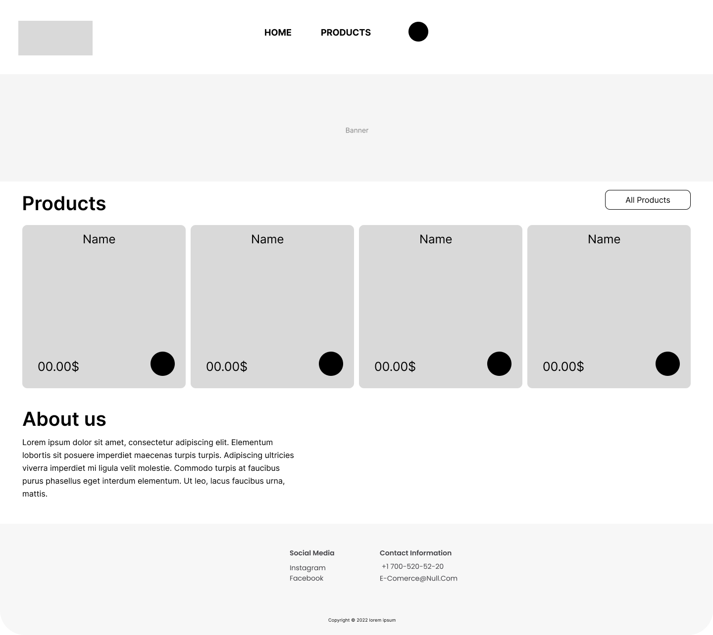
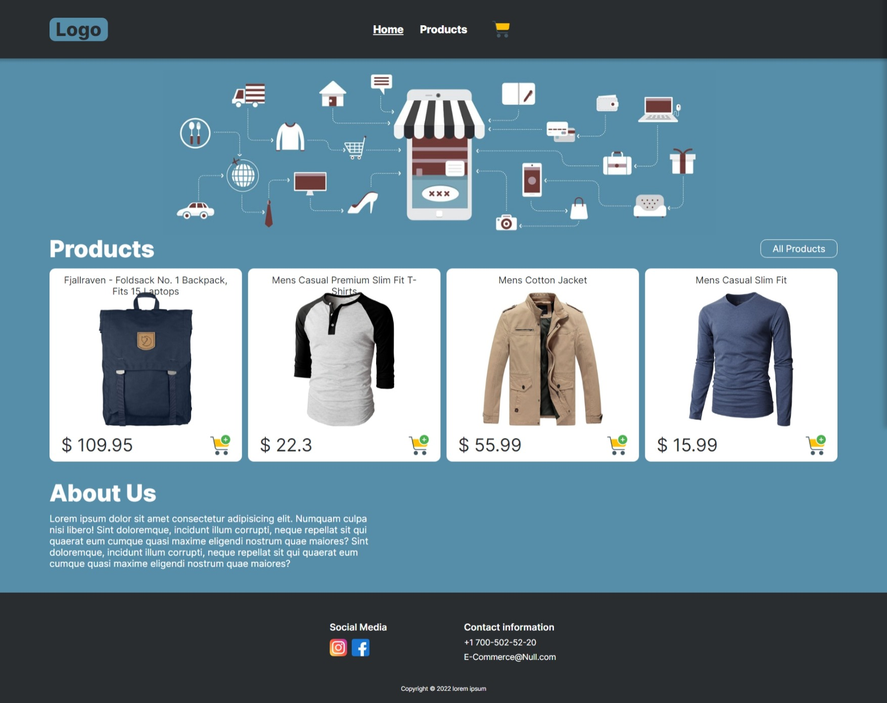

# E-Commerce

## Table of Contents

- [General Information](#general-information)
- [Wireframes](#wireframes)
- [Screenshots](#screenshots)
- [Technologies Used](#technologies-used)
- [Features](#features)
- [Setup](#setup)

## General Information

this page is an E-Commerce simulation

## Wireframes



## Screenshots



## Technologies used

- React
- Redux
- React Router v6
- Sass
- Fetch

## Features

- Web site responsive
- Home (navbar, banner, listing products, about us, footer)
- Products (show all products)
- Product detail (info of product, product detail, add to cart)
- SideCart (initial state empty, show added products, user might delete products, show amount of products, show total sale)

## Setup

To run this project, install it locally using npm:

Clone or download the repo then:

```
$ npm install
$ npm start
```
